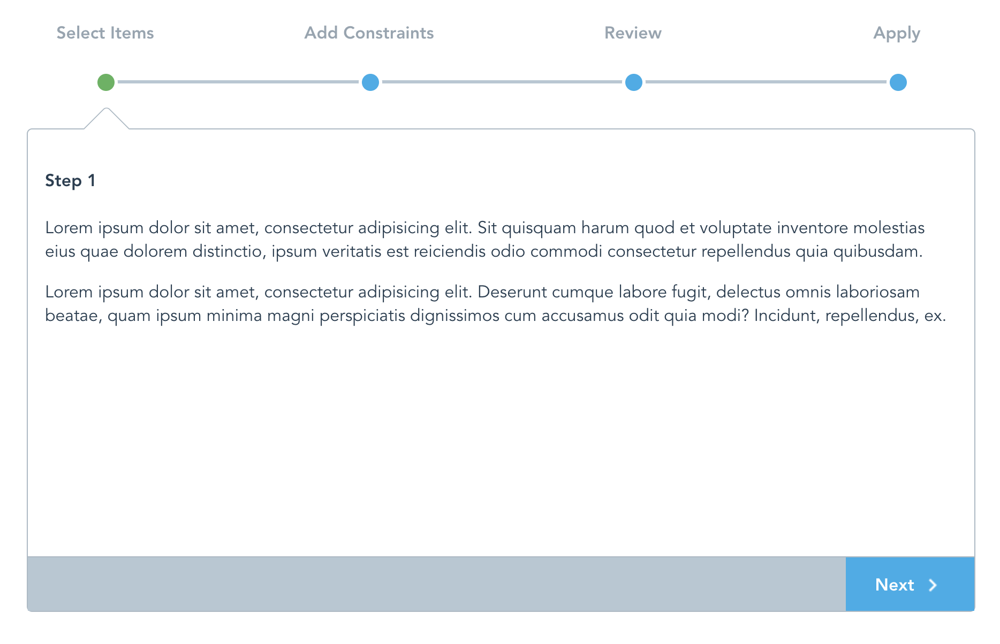

# vue-good-wizard
An easy and clean VueJS 2.x wizard plugin



## Getting Started

### Prerequisites

The plugin is meant to be used with existing VueJS 2.x projects.


### Installing

Install with npm:
```
npm install --save vue-good-wizard
```

import into project:
```
import Vue from 'vue';
import VueGoodTable from 'vue-good-wizard';

Vue.use(VueGoodWizard);
```

## Example Usage

```html
<template>
  <div>
    <vue-good-wizard 
      :steps="steps"
      :onNext="nextClicked" 
      :onBack="backClicked">
      <div slot="page1">
        <h4>Step 1</h4>
        <p>This is step 1</p>
      </div>
      <div slot="page2">
        <h4>Step 2</h4>
        <p>This is step 2</p>
      </div>
      <div slot="page3">
        <h4>Step 3</h4>
        <p>This is step 3</p>
      </div>
      <div slot="page4">
        <h4>Step 4</h4>
        <p>This is step 4</p>
      </div>
    </vue-good-wizard>
  </div>
</template>

<script>
export default {
  name: 'demo',
  data(){
    return {
      steps: [
        {
          label: 'Select Items',
          page: 'page1',
        },
        {
          label: 'Add Constraints',
          page: 'page2',
        },
        {
          label: 'Review',
          page: 'page3',
        },
        {
          label: 'Apply',
          page: 'page4',
        }
      ],
    };
  },
  mounted(){
  },
  methods: {
    nextClicked(currentPage) {
      console.log('next clicked', currentPage)
      return true; //return false if you want to prevent moving to next page
    },
    backClicked(currentPage) {
      console.log('back clicked', currentPage);
      return true; //return false if you want to prevent moving to previous page
    }
  },
};
</script>
```
This should result in the screenshot seen above

### Component Options
<table>
  <thead>
    <tr>
      <th>Option</th>
      <th>Description</th>
      <th>Type, Example</th>
    </tr>
  </thead>
  <tbody>
    <tr>
      <td>steps (required)</td>
      <td>Array of objects that specify step titles and page id</td>
      <td>
<pre lang="javascript">
[
  {
    label: 'Add Constraints', // title for wizard step
    page: 'page2', //id for div to show for this step
  },
  //...
]
</pre>
      </td>
    </tr>
    <tr>
      <td>
        onNext (optional)
      </td>
      <td>
        function called before next page is shown. This is a good place to do validation etc. Return true to proceed, or false to stay on the same page.
      </td>
      <td>
        function ex: 
<pre lang="javascript">
function(currentPage){
  console.log(currentPage);
  return true;
}
</pre>
      </td>
    </tr>
    <tr>
      <td>
        onBack (optional)
      </td>
      <td>
        function called before previous page is shown. Return true to proceed, or false to stay on the same page.
      </td>
      <td>
        function ex: 
<pre lang="javascript">
function(currentPage){
  console.log(currentPage);
  return true;
}
</pre>
      </td>
    </tr>
  </tbody>
</table>

## Authors

* **Akshay Anand** - *Initial work* - [xaksis](https://github.com/xaksis)

## License

This project is licensed under the MIT License - see the [LICENSE.md](LICENSE) file for details